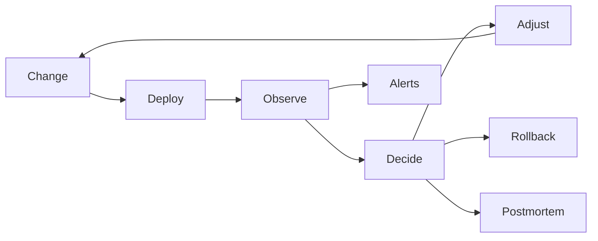
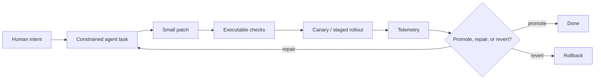

# Informal Methods

Reliability lessons for an era of agentic AI tools

<div class="mt-12 text-xl opacity-80">
BugBash 2026
</div>

<!--
The framing: this is not a talk about replacing formal methods. It is about the
informal engineering controls SRE already uses when correctness is too large to
prove locally and too important to leave to vibes.
-->

---
layout: statement
---

# The robot was very confident.

The service was very surprised.

<!--
Cold open story scaffold. Replace the bracketed pieces with a real incident from
your career before presenting.

"I want to start with a very small story about the time I asked [AI tool] to do
something extremely reasonable: [small task, like fix a flaky test / update a
runbook / make a one-line config change].

It responded with the kind of confidence you normally only see from a senior
engineer who has not read the error message yet.

The actual diff did [silly thing]: it removed the retry loop because it looked
redundant, renamed the flag because the old name was ugly, rewrote a helper it
didn't understand, and then wrote a lovely PR description explaining that this
reduced complexity.

And the worst part was: locally, it passed.

Staging, being less easily charmed by prose, immediately disagreed. My
five-minute helper-bot task became an afternoon of archaeology, where I had to
explain to a machine that sometimes dead code is load-bearing code, and sometimes
the weird branch exists because production has been patiently teaching us things
since 2019.

The lesson I took away was not 'never use agents.' The lesson was: if a system
can generate plausible work faster than I can inspect it, then my real safety
tool cannot be the inspection. It has to be the loop around the work."

The segue: "That loop is what this talk is about."
-->

---
layout: two-cols
layoutClass: gap-12 items-center
---

<!--
Replace this placeholder with an image when ready, for example:

-->

<div class="h-110 w-full rounded-2xl border border-black/15 bg-white/45 shadow-xl flex items-center justify-center">
  <div class="text-center opacity-60">
    <div class="text-4xl font-bold">Photo</div>
    <div class="mt-3 text-lg">your picture goes here</div>
  </div>
</div>

::right::

# About me

<ul class="mt-10 space-y-5 text-2xl leading-normal">
  <li v-click>Your name / role</li>
  <li v-click>The reliability scar tissue you bring to this talk</li>
  <li v-click>Why agentic tools are now part of your workflow</li>
  <li v-click>The thing you want the audience to remember about you</li>
</ul>

<!--
These bullet points are placeholders. Each li has v-click so the bullets appear
one at a time while the rest of the deck remains transition-free.
-->

---
layout: statement
---

# Agentic AI changes the economics of software change.

It does not change the need for reliability.

<!--
The important shift is not "AI can code". The important shift is that generating
reasonable-looking changes is becoming much cheaper than reviewing them.
-->

---

# The thesis

Some reliability practices get **more valuable** with agents:

<div class="mt-6">

- Small, frequent rollouts
- Good monitoring and alerting
- Fast rollback and progressive delivery
- Incident review and operational feedback loops

</div>

<div class="mt-8">

Some practices get **less reliable**:

- Code review as the primary safety mechanism
- Human expert review as a universal gate
- Launch approval based on reading artifacts instead of exercising behavior

</div>

<!--
I want to separate the tools that improve with higher change velocity from the
tools that assume human attention is abundant.
-->

---

# The old bargain

For a long time, reliability practice quietly assumed:

- Producing changes is expensive
- A reviewer can inspect the important parts
- Reviewers share enough context to notice the weird thing
- A small number of experts can sit at critical gates
- Slow enough process can compensate for incomplete automation

<!--
This bargain was never perfect, but it was often good enough because humans were
the bottleneck on both producing and accepting change.
-->

---

# Agents break that bargain

They make it cheap to produce:

- plausible diffs
- plausible designs
- plausible explanations
- plausible tests
- plausible incident summaries

<div class="mt-8 text-2xl">
The scarce resource becomes <strong>trustworthy evaluation</strong>.
</div>

<!--
The problem is not that agent output is always bad. The problem is that it is
cheap enough and plausible enough to overwhelm the old review economics.
-->

---

# Reliability has always been a feedback-loop problem



<div class="mt-6">
SRE works when the loop is short, instrumented, and safe to repeat.
</div>

<!--
This is why SRE patterns transfer well. They assume local reasoning is
incomplete and that systems need an external source of truth.
-->

---

# "Informal methods"

Not proofs. Not vibes.

<div class="mt-8 text-2xl leading-normal">
Practical controls that make unreliable people, code, and systems reliable
enough by tightening the loop between <strong>intent</strong>, <strong>behavior</strong>, and <strong>consequence</strong>.
</div>

<!--
This is the title move. The formal-methods audience will recognize the contrast:
these are lower-rigor methods, but they are not unserious.
-->

---
layout: two-cols
layoutClass: gap-12
---

# Transfers well

- Small batches
- Frequent deploys
- Feature flags
- Canarying
- Rollback muscle
- SLOs
- Alerts on symptoms
- Test automation
- Post-incident learning

::right::

# Transfers poorly

- Big-bang review
- Expert sign-off queues
- "LGTM" as a safety case
- Reviewing generated text as proof
- Manual launch checklists with no executable checks
- Trusting confidence more than telemetry
- Centralized ownership of all risk decisions

<!--
This is the core split. The first column improves when changes are cheap. The
second column collapses when changes are cheap.
-->

---

# Why small rollouts work

Fast and frequent rollout practice was built for uncertainty.

<div class="mt-8 grid grid-cols-3 gap-4">
  <div class="rounded border p-4">
    <div class="text-xl font-bold">Smaller blast radius</div>
    <div class="mt-2 opacity-75">Agent patches can be scoped to one behavior.</div>
  </div>
  <div class="rounded border p-4">
    <div class="text-xl font-bold">Faster attribution</div>
    <div class="mt-2 opacity-75">A bad change is easier to connect to its symptom.</div>
  </div>
  <div class="rounded border p-4">
    <div class="text-xl font-bold">Cheaper retries</div>
    <div class="mt-2 opacity-75">Regenerate, repair, or revert without drama.</div>
  </div>
</div>

<!--
Agent workflows should lean into smaller PRs and smaller deploys. Do not ask one
reviewer to bless a giant generated change.
-->

---

# Monitoring gets better, not worse

Monitoring and alerting are valuable because they are outside the agent's narrative.

<div class="mt-8">

- Did latency move?
- Did error rate move?
- Did the queue drain?
- Did the user-visible task complete?
- Did we violate the invariant?

</div>

<div class="mt-8 text-2xl">
The system's behavior outranks the agent's explanation.
</div>

<!--
An agent can be very persuasive about why a change is safe. Telemetry does not
care. That is exactly why we should invest more in it.
-->

---

# Alerts should be about symptoms

Bad:

- "The agent said the migration was safe."
- "The generated tests passed."
- "The PR description says no user impact."

<div class="mt-8">
Good:
</div>

- "Checkout success rate fell below the SLO."
- "A canary cohort is seeing elevated 5xxs."
- "The invariant monitor found duplicate ownership."

<!--
This is the same SRE lesson as before. Page on customer pain and broken
invariants, not on the internal ceremony that preceded them.
-->

---

# Rollback is an AI safety primitive

If agents make changes cheaper, reversibility becomes more important.

<div class="mt-8 grid grid-cols-2 gap-8">
  <div>
    <h3>Prefer</h3>
    <ul>
      <li>Feature flags</li>
      <li>Canary deploys</li>
      <li>Backward-compatible migrations</li>
      <li>Automated rollback triggers</li>
    </ul>
  </div>
  <div>
    <h3>Avoid</h3>
    <ul>
      <li>Irreversible generated migrations</li>
      <li>Mixed refactor plus behavior PRs</li>
      <li>Manual rollback plans written after the fact</li>
      <li>One-shot approval for high-blast-radius changes</li>
    </ul>
  </div>
</div>

<!--
This is not special pleading for AI. It is normal operational hygiene becoming
more central because the volume of attempted changes increases.
-->

---

# Where human review stops scaling

Code review used to be a useful choke point.

<div class="mt-8 text-3xl leading-normal">
In an agentic workflow, it can become a lossy compression algorithm for risk.
</div>

<div class="mt-8">

- The diff is larger than the reviewer budget
- The explanation is written by the same system that wrote the change
- The test plan is plausible but not adversarial
- The reviewer is asked to verify context they do not actually hold

</div>

<!--
The point is not "never review code". The point is "stop treating review as the
main proof of safety."
-->

---

# Expert review is everywhere

We do not only review code.

<div class="mt-6 grid grid-cols-2 gap-x-10 gap-y-3">
  <div>API designs</div>
  <div>Architecture docs</div>
  <div>Security exceptions</div>
  <div>Launch plans</div>
  <div>Migration plans</div>
  <div>Incident updates</div>
  <div>Runbook changes</div>
  <div>Dashboard edits</div>
  <div>Alert tuning</div>
  <div>Dependency updates</div>
  <div>Customer comms</div>
  <div>Postmortems</div>
</div>

<div class="mt-8 text-2xl">
Agents increase the volume of every one of these artifacts.
</div>

<!--
This is the part I want to emphasize: human expert review is not just PR review.
Development is packed with gates that depend on an expert reading a thing and
deciding it is safe.
-->

---

# The review monoculture

When we lack executable confidence, we ask a human to look at it.

<div class="mt-8">

That turns into:

- review as testing
- review as threat modeling
- review as rollout safety
- review as product validation
- review as incident detection
- review as organizational memory

</div>

<div class="mt-8 text-2xl">
One tool cannot carry that much load.
</div>

<!--
This slide should feel slightly uncomfortable because it describes a lot of
normal engineering process.
-->

---
layout: statement
---

# Replace review of artifacts with evaluation of behavior.

<!--
This is the pivot from critique to prescription.
-->

---

# Make review executable

Ask for artifacts only when they create or explain checks.

```yaml
change:
  intent: "Reduce queue latency by changing worker batching"
  risk: "Can reorder low-priority jobs"

required_evidence:
  - load_test: "p95 queue latency improves"
  - invariant: "per-account job ordering preserved"
  - canary: "no SLO regression for 30 minutes"
  - rollback: "flag disables new batcher"
```

<div class="mt-4">
The review target is the safety case, not the prose.
</div>

<!--
This is intentionally not a perfect schema. It is a pattern: capture intent and
risk, then connect them to executable evidence.
-->

---

# Move humans up the stack

Humans should spend attention on:

- Choosing the goal
- Defining acceptable risk
- Setting boundaries and permissions
- Designing new checks when the old checks are blind
- Reading small, high-leverage diffs
- Investigating surprising behavior

<div class="mt-8 text-2xl">
Do not spend scarce expert attention re-reading every generated token.
</div>

<!--
This is the constructive version of "code review is not enough." Human review is
still essential, but it should be spent where humans are strongest.
-->

---

# A better agentic change loop



<div class="mt-4">
The loop should make the safe thing boring and the unsafe thing hard.
</div>

<!--
The key pieces: constrained tasks, small patches, executable checks, and
telemetry-driven decisions.
-->

---

# What to measure

If review is not the main safety mechanism, measure the loop.

- Change size
- Time to detect bad change
- Time to rollback
- Fraction of changes with automated evidence
- Canary escape rate
- Alert precision
- Repeated incident themes
- Reviewer time spent per unit of risk

<!--
These are not all perfect metrics. The point is to move measurement away from
"did a human approve it?" toward whether the system catches and contains harm.
-->

---

# The useful split

Keep:

- controls that shorten feedback loops
- controls that exercise real behavior
- controls that reduce blast radius
- controls that improve after incidents

<div class="mt-8">
Replace:
</div>

- controls that require unlimited expert attention
- controls that trust generated explanations
- controls that batch risk into a single approval moment

<!--
This is the talk in one slide.
-->

---
layout: statement
---

# Informal methods assume the contributor is unreliable.

That is why they still work.

<!--
End with the title. The SRE lesson is durable because it never required perfect
contributors. It required systems that noticed, contained, and learned.
-->

---

# Closing

Agentic AI makes software change easier to produce.

It makes reliability engineering more important, not less.

<div class="mt-10 text-2xl">
Design for cheap change, expensive attention, and observable truth.
</div>

<style>
:global(:root) {
  --slidev-theme-primary: #b84e37;
}

:global(.slidev-layout) {
  background:
    radial-gradient(circle at 12% 15%, rgba(184, 78, 55, 0.16), transparent 30%),
    radial-gradient(circle at 88% 85%, rgba(37, 85, 124, 0.14), transparent 35%),
    #f8f1e8;
  color: #24201b;
}

:global(.slidev-layout h1) {
  color: #3f342b;
}

:global(.slidev-layout strong) {
  color: #b84e37;
}

:global(.slidev-layout pre) {
  border: 1px solid rgba(63, 52, 43, 0.16);
}

:global(.slidev-layout .rounded) {
  background: rgba(255, 255, 255, 0.46);
  border-color: rgba(63, 52, 43, 0.18);
}
</style>
